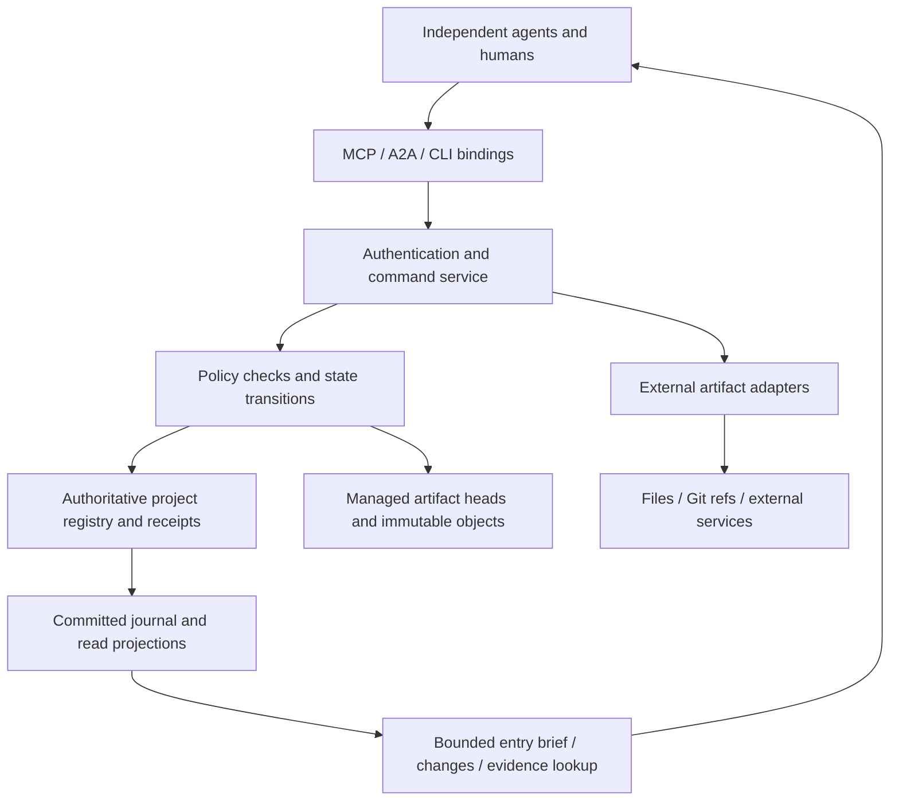

# Musubi Kairo: collaboration protocol architecture

Design proposal 0.2 · 2026-09-28 · review required before implementation.

**Current design priority (2026-09-29):** the
[collaboration semantics candidate](../protocol/collaboration-semantics.md)
develops the end-to-end contract and proposes explicit obligation/result records.
Protocol questions determine which small models are useful. Repairing or extending
an executable model is not a prerequisite for finishing that contract. The
implementation sequence below is historical planning, not the current work queue.

**Purpose reassessed:** [agent-first design direction](agent-first-reframe.md)
now takes precedence for initial users, discovery/bootstrap, network priority,
credential continuity and lease/delegation work. This 0.2 text remains the
technical baseline; its local pre-enrollment and explicit-only takeover are
not the recommended first network experience. The amendment is not a completed
new conformance profile.

This document specifies a candidate observable contract, a first policy profile,
and a path to implementation. It is not a released standard or evidence that a
coordinator exists. Capitalized MUST/MUST NOT identify proposed requirements
within the named profile. They do not imply that the project owner has approved
every design choice. This document supersedes overlapping parts of the initial
[core sketch](../protocol/core.md). The [conformance matrix](../protocol/conformance.md)
tracks how its claims must be challenged.

Read sections 1–4 for the architecture, 5–13 for the operational contract,
14–16 for failure and scale boundaries, and 17–20 for validation and decisions.
The [Russian reading guide](architecture-guide-ru.md) is explanatory, not a
second specification.

## 1. What the protocol is responsible for

Musubi Kairo lets independently operated participants contribute to a shared
project while retaining an explicit goal, attributable positions, authorized
decisions, versioned results, and recoverable unfinished obligations.

The unit of collaboration is a project with durable state. A conversation,
model invocation, process, transport session, and execution attempt each have
shorter, independently controlled lifetimes. None is the project identity.

The protocol makes a commitment inspectable: who authorized which change,
under which goal and policy, against which inputs, and with which evidence.
It cannot prove that an agent understood the goal or that a fluent rationale
is true. Semantic quality needs human judgment and domain-specific checks.

### 1.1 Context map

| Element | Architectural interpretation |
| --- | --- |
| Independent AI and human participants | Stable actors with explicit, revisable authority; no required model vendor or central reasoning agent |
| Shared document, code, or project | Versioned artifacts and work linked to a goal; artifact adapters declare actual write guarantees |
| Retaining the goal | Every consequential operation binds current goal and constraints; goal changes invalidate old execution authority |
| Akari integration | First integration environment; its persona, temporal, and contribution conventions remain optional mappings |
| Easy deployment | Local embedded service is sufficient; no mandatory cloud account, vector database, broker, or daemon |
| One service data location | Project state, durable objects, indexes, temporary files, and logs under `.kairo/` |
| Many agents and long histories | Scoped participation, bounded reads, incremental indexes, explicit backpressure and retention |
| Unknowns | Useful latency and context budgets, actual client compatibility, semantic-review quality, adapter durability on target filesystems |

### 1.2 Requirements and deliberate limits

**R1** Preserve goal, dissent, authority, provenance, and unfinished work across
agent replacement. **R2** Prevent stale controlled publication and duplicate
accepted mutations. **R3** Make recovery possible without replaying an entire
conversation into a model. **R4** Keep protocol semantics independent of MCP,
A2A, storage engine, and model implementation. **R5** Give a small deployment
an uncomplicated operating model. **R6** Make resource consumption explicit.

Unbounded participant count, perpetual history at constant cost, Byzantine
consensus, universal semantic conflict detection, and exactly-once arbitrary
external effects are not promised. A larger team increases coordination cost;
the design avoids requiring every member to process every event.

## 2. Architecture and guarantee profiles

The registry has one logical mutation authority per project. It serializes
short state changes, not model inference or preparation of large artifacts.
Actors retain their own planning, tools, memory, and execution environments.
Policy authority is separate from infrastructure authority: the store does
not become a deciding agent merely because it orders commands.

| Profile | Promised boundary | What it cannot claim |
| --- | --- | --- |
| `semantic-0.2` | Shared vocabulary, references, policy meanings, explicit outcomes | Enforcement against uncontrolled writes |
| `managed-0.2` | Serializable registry checks/mutations, durable receipts, replay and bounded reads | Correctness of an arbitrary external side effect |
| `managed-artifact-0.2` | Atomic publication of a managed artifact head together with decision consumption and receipt | Atomic changes to an editor's live file or an external Git branch |
| External adapter, future | Only guarantees in its separately versioned contract | Inheriting managed atomicity from an API name |

The first implementation target combines all three defined profiles with the
`owner-review-0.2` policy below. A file-only advisory workflow can implement
`semantic-0.2`, but MUST expose its weaker boundary in discovery and results.
Conformance is a tuple of versions and profiles, not a single compatible flag.

### 2.1 First deployment shape

A single embedded transactional store and immutable object directory under
`.kairo/` are the reference deployment proposal. SQLite is a candidate engine,
not part of the protocol. A local MCP process or CLI can open the same service
library. Concurrent processes need the database's actual cross-process locking;
an in-memory mutex in each process is insufficient.

Inference, network fetches, compilation, and bulk hashing MUST run outside
registry transactions. The registry publishes references to already durable
objects. Remote hosting can preserve the same observable operations later.

## 3. Non-negotiable invariants

| ID | Invariant |
| --- | --- |
| I01 | A receipt, endorsement, decision, publication, and verification are different facts |
| I02 | Every consequential grant names immutable goal, policy, authority, proposal, and input revisions |
| I03 | Current authority is checked atomically with a registry mutation; self-declared JSON identity is insufficient |
| I04 | One command identity produces at most one committed registry outcome |
| I05 | Accepted mutation, its event batch, and command receipt commit together or not at all |
| I06 | Changed content never inherits another revision's endorsements implicitly |
| I07 | An objection remains attributable and accessible even when a contrary decision is taken |
| I08 | A stale attempt generation cannot publish through a conforming controlled path |
| I09 | A managed artifact update compares all declared input heads and publishes its new head in the same transaction |
| I10 | Expired history or deduplication state cannot turn a stale request into a new effect |
| I11 | A goal change blocks new publication under the old goal; it does not erase an earlier publication |
| I12 | A terminal attempt is never reopened; continuation gets a new attempt ID |
| I13 | A partial response declares its coverage; omission is not absence and receipt is not understanding |
| I14 | Replay uses recorded outcomes and schema versions, never a new model judgment or today's policy |
| I15 | Completion is evidence about a named result and criteria, not the fact that an executor stopped |
| I16 | A notification, wall-clock timestamp, or journal position alone is not evidence of causal dependence |

Durable acknowledgements assume the store's declared durability boundary
survives a process crash. Protection against device loss depends on backup or
replication. Acknowledging data before that declared boundary is crossed breaks
the profile; calling the write asynchronous does not relax I05.

## 4. State model and identity

All object IDs are opaque, project-scoped strings. A locator is separate from
identity; moving a directory does not rename its project or artifacts. A
revision is immutable. Changing text, constraints, membership, or required
reviewers creates a new revision; mutable heads point to revisions.

| Record | Required meaning |
| --- | --- |
| Project | ID, protocol/profile tuple, current control tuple, active incarnation, retention and resource limits |
| Actor | Stable ID bound to authenticated principal; human/service/agent type is descriptive |
| Run | One execution context of an actor; useful attribution, never independent permission |
| MembershipRevision | Actors, roles, explicit scope grants, credential bindings, and predecessor |
| GoalRevision | Objective, constraints, acceptance criteria with stable IDs, parent goal, change rationale |
| PolicyRevision | Decision profile and parameters, bootstrap/change authority, predecessor |
| WorkItem | Immutable specification revisions: goal, scope, output criteria, dependencies; mutable lifecycle and attempt generation |
| Attempt | Work revision, actor/run owner, generation, execution state, predecessor attempt and result references |
| ProposalRevision | Work reference, goal/policy/membership tuple, exact change plan, full read/write set, reviewers, rationale and evidence |
| Assessment | Actor's immutable position on exact proposal revision; optional replacement of that actor's earlier assessment |
| Decision | Immutable approval/rejection, assessed snapshot and rationale; separately tracked live authorization status |
| ArtifactRevision | Artifact ID, opaque revision ID, media type, immutable content reference, content digest, parent revision |
| Verification | Result revision, named criterion verdicts, evidence, verifier identity, and control tuple |
| Handoff | Recipient, snapshot coordinate, obligations, next action, constraints and resolvable evidence references |
| Checkpoint | Consistent projection, journal boundary, schema, current heads, reachability manifest and integrity digest |

The **control tuple** is `(goal_rev, policy_rev, membership_rev)`. Revisions of
work, proposal, assessment set, and artifact heads are additional predicates.
The tuple is intentionally conservative: even an unrelated membership change
invalidates earlier execution grants in this first profile. Scope-specific
authority epochs are a future optimization, not an implicit exemption.

Content digest and revision ID serve different purposes. Restoring identical
bytes creates a fresh revision and does not fool a compare-and-swap check into
accepting an old base (the ABA problem). Hash matches do not prove authorship.
Credential rotation preserves actor identity but creates a membership revision;
revocation removes future authority, not historical attribution.

## 5. Goal, governance, and authority changes

### 5.1 Bootstrap

Project creation is an explicit local-owner operation outside an existing
project. It creates the first goal, policy, membership, project incarnation,
and owner in one transaction. The deployment must authenticate that owner;
possession of a path is not assumed to be remote authentication.

The initial policy names exactly one active owner. It can be a human or an
explicitly delegated service identity. Agents do not elect themselves owner.
An owner may grant scoped proposer, executor, reviewer, or verifier roles.
Reading private evidence also requires a grant.

`project.control.replace` requires the current owner and an expected control
tuple. It atomically installs new goal, policy, and/or membership revisions.
Owner transfer names an already enrolled actor that has recorded acceptance of
that exact transfer proposal. The old owner authorizes the transfer. This is
governance, not ordinary artifact review; old and new authority are recorded.
No automatic succession is specified if the sole owner is permanently lost.
Deployments may offer an explicit audited administrative recovery procedure;
it must not appear as an ordinary owner-signed command.

### 5.2 Goal change

A new goal revision identifies what changed and why. Earlier artifacts and
assessments remain historical evidence. Pending proposals and active attempts
under the old tuple become **ineligible**, derived by tuple mismatch. This
does not require synchronously rewriting every work record.

The owner can cancel old work or create a new work revision bound to the new
goal, with an explicit reuse/discard rationale for existing results. An active
attempt must be stopped or abandoned before the new work revision can be
claimed. Proposal content can be reused by reference, but a new proposal under
the new tuple needs new assessments and decision. There is no blanket automatic
grandfathering of old approvals.

If goal replacement races publication, the registry's transaction order is
decisive. Publication before replacement is a valid old-goal result, marked for
new-goal evaluation. Replacement before publication causes `STALE_CONTROL`.
Canceling work cannot undo a publication that already committed.

`goal.evaluate` records the owner's evidence-based assessment against every
current goal criterion, including referenced work/results and outstanding
exceptions. It is a historical evaluation, never permission to bypass later
checks. The current success view is stale when any referenced result head or
control revision changes. Closing the project requires such a current pass and
no open work; reopening is a new explicit owner operation.

## 6. Decision profile: owner-review-0.2

This is one complete initial decision rule, not a universal theory of consensus.
Quorum, unanimous, delegated, and automatic policies may be added as explicit
profiles. Changing profiles requires the governance operation above.

### 6.1 Opening review

A proposer creates a proposal against a current work revision and control tuple.
It contains the immutable candidate output, exact managed input revisions,
write scope, rationale, criterion mapping, and a nonempty required-reviewer set.
Every required reviewer must have the corresponding scope grant and differ
from the proposer. The owner sets the allowed reviewers in the work revision;
the proposer cannot choose a more permissive subset. Unavailable reviewers
require an explicit work revision and renewed review, not silently ignored slots.

Reviews can be prepared concurrently with execution. A proposal need not own an
attempt; publication needs a live attempt for its work. This allows a replacement
executor to use an already approved immutable result when all predicates remain
true. No actor is required to expose private chain-of-thought: a rationale and
checkable evidence are sufficient.

### 6.2 Assessment semantics

An assessment stance is `support`, `object`, `needs_info`, or `abstain`. It names
an exact proposal revision and criterion/scope, plus grounds and evidence.
The current position of one actor is the end of its explicit replacement chain.
Two concurrent replacements must compare that chain's current head; one conflicts.
Old assessments remain readable. A new proposal revision begins with no carried
endorsements, including when the textual edit is small.

Required reviewer slots are satisfied only by current `support`. `object`,
`needs_info`, `abstain`, and absence all block approval. Silence never becomes
consent. Other eligible actors can add advisory objections. The owner must record
an individual disposition and reason for each currently unresolved advisory
objection: accept and revise, or decline with grounds. Declining does not remove
the objection or attribute agreement to its author.

### 6.3 Creating a decision

Only the current owner can approve or reject. Approval MUST atomically check:

1. Current control tuple and exact current work/proposal revisions.
2. Every required reviewer is still authorized and has current `support`.
3. The full assessment-set revision equals the revision the owner reviewed.
4. Every unresolved advisory objection has an explicit disposition in the decision.
5. Every declared input revision still exists and is the current managed head;
   every planned output object is durable and matches its advertised digest.
6. The proposal has no prior decision and is neither withdrawn nor superseded.

The decision records all predicates and assessment references. Rejection needs
owner authority, exact revisions and reasons, but not supportive reviews. A
decided proposal cannot receive a second decision; a new decision requires a
new proposal revision, with a predecessor link and renewed review.

Fresh assessments are accepted only while a proposal is open. A late objection
to an approved proposal is a separate issue. The owner or any authorized required
reviewer can call `decision.hold`, naming that issue and exact decision, to
disable unpublished approval immediately. Hold is irreversible in this profile:
resumption requires a new proposal/decision. An actor who can only comment cannot
silently block an approved publication. Published results require follow-up work;
a hold records a post-publication issue but cannot claim to have stopped history.

### 6.4 Approval is an execution grant

An approved decision has derived authorization status `eligible`, `stale`,
`held`, `consumed`, or `retired`. `eligible` requires all recorded predicates
still to hold. It is not a permanent capability token. Publication consumes
the grant once. A subsequent retry returns the same publication receipt.

Changing work/proposal head retires unpublished approvals for the previous head.
Changing a managed dependency makes its approval stale even if output paths
do not overlap. Read-set completeness is the proposer's responsibility; hidden
dependencies are an explicit semantic limitation, not a solved conflict problem.

### 6.5 Review operation catalogue

All rows inherit section 8's identity, access, control and expected-revision checks.

| Command | Caller and additional precondition | Result |
| --- | --- | --- |
| `proposal.create` | Scoped proposer; current open work; reviewers fixed by work; resolvable bases/objects | First open proposal revision |
| `proposal.revise` | Original proposer or owner; expected proposal head; eligible work | New open revision; previous head superseded; unpublished grant retired |
| `proposal.withdraw` | Original proposer or owner; open undecided revision | Withdrawn revision; history retained |
| `assessment.record` | Scoped reviewer/commenter; current open proposal; no existing position by this actor | First position; assessment-set revision advances |
| `assessment.replace` | Same actor as replaced assessment; expected actor-position head and open proposal | Replacement position; prior record retained |
| `decision.approve` | Owner; all section 6.3 approval predicates | Approved immutable decision; proposal decided |
| `decision.reject` | Owner; current undecided proposal and reasons | Rejected immutable decision; proposal decided |
| `issue.record` | Scoped commenter; exact subject and grounds | Open issue, without changing an existing grant |
| `decision.hold` | Owner or currently authorized required reviewer; exact approved decision and issue | Unpublished grant held, or post-publication issue explicitly reported |
| `issue.resolve` | Owner; expected issue revision; disposition and evidence | Resolved issue; original grounds retained; held grants stay held |

A proposal revision's review state is open, withdrawn, or decided. Supersession
is a relationship to a newer head, not deletion of its prior review state.
`proposal.revise` does not erase an already consumed grant or publication.
All review mutations compare the expected proposal head; concurrent revision,
assessment and decision operations therefore have an explicit serial outcome.
Historical assessments remain readable after withdrawal or supersession.

Every superseded revision remains addressable by its immutable ID. The Q1/Q2
labels in the walkthrough abbreviate revisions of one proposal family. A required
reviewer cannot be removed by editing that proposal; reviewer selection belongs
to the owner-controlled work revision.

## 7. Work, ownership, and progress

Work lifecycle is `open`, `completed`, or `canceled`. Blocked/ready/running/
awaiting-verification are derived views, avoiding contradictory parallel status
flags. A work revision names dependency work revisions and exact accepted results.
Dependency cycles are rejected; unresolved dependencies block claim/publication.

At most one nonterminal attempt exists per work item in this profile. Different
work items execute concurrently. Their declared scopes provide scheduling hints;
overlap warnings alone do not grant an exclusive artifact lock. Actual publication
is protected by revision checks. Independent attempts may prepare competing
changes, but cannot overwrite a changed base.

| Command | Preconditions beyond envelope checks | State transition |
| --- | --- | --- |
| `work.create` | Owner; current tuple; acyclic dependencies; assigned roles/scopes exist | New open work revision |
| `work.revise` | Owner; expected work head; no nonterminal attempt | New work revision; prior approvals retired |
| `attempt.claim` | Scoped executor; open eligible work; dependencies met; no live attempt; expected generation | Increment generation; new `executing` attempt |
| `attempt.abandon` | Current attempt owner or project owner; no indeterminate external effect | `executing` → `abandoned`; grant generation revoked |
| `attempt.fail` | Current attempt owner; reason/evidence; no unknown external effect | `executing` → `failed` |
| `work.cancel` | Owner; expected work revision; no unknown external effect | Open → canceled; executing attempt → canceled; unpublished grants retired |
| `artifact.publish` | Section 9 predicates | `executing` → `applied`; artifact head changes |
| `verification.record` | Section 10 predicates | Applied remains applied; immutable evidence added |
| `work.complete` | Owner; current passing verification set and result head | Open → completed; applied → succeeded |
| `verification.fail_work` | Owner; current failing verification and result | Applied → failed; work remains open for a revised plan |

Cancellation of an applied attempt changes it to `canceled` with its publication
reference retained. Its artifact is untouched. Completion is never attributed to
a canceled attempt. New work can consume a canceled attempt's result only through
an explicit new review. `abandoned`, `failed`, `canceled`, and `succeeded` are
terminal. New attempts retain predecessor links and use a larger generation.

Administrative abandonment/cancellation may target stale-goal work. The command
is authorized by the **current** control tuple and names the exact historical
target; it does not require that target to become eligible again. Otherwise a
goal change would prevent cleaning up the very work it invalidates.

**First profile: explicit ownership transfer, no time-based leases.** To transfer,
the current executor or owner abandons the old executing attempt; another executor
claims a new one. Waiting forever is possible if the owner and executor both
disappear. This availability cost is explicit. A future lease profile must define
authoritative time, restart behavior and fencing before advertising automatic
takeover. A heartbeat alone must not enable unsafe reassignment.

## 8. Commands, receipts, and errors

### 8.1 Command identity and normalization

Every mutation carries `protocol_version`, `profile`, `project_id`,
`incarnation_id`, `actor_id`, `run_id`, `operation_epoch`, `operation_id`, `kind`,
`control`, `expected`, `parents`, and `payload`. Collection fields are present
even when empty. Unknown semantic fields fail validation; optional opaque metadata
belongs in a declared extension. Expected revisions are keyed by stable object ID.
All decimal counters are strings, avoiding cross-language integer precision loss.

The execution identity is `(project_id, incarnation_id, actor_id,
operation_epoch, operation_id)`. A random operation ID alone does not provide a
bounded replay-defense policy. The service allocates a monotonically increasing
epoch per actor; at most one epoch is open per actor in the baseline profile.
Multiple runs of the actor share it and choose distinct operation IDs.

The command fingerprint is SHA-256 of UTF-8 JCS of the complete semantic envelope.
Transport headers, credentials, HTTP/JSON-RPC IDs, and tracing headers are outside
it. `run_id` is inside; a recovery run retries the original stored envelope, not
a modified attribution. Set-like arrays must already be unique and sorted by
their specified ID strings. No inferred defaults or Unicode normalization are
inserted. Duplicate keys and invalid Unicode fail parsing. JCS is defined in
[RFC 8785](https://www.rfc-editor.org/rfc/rfc8785.html); these envelope and epoch
rules are Kairo design decisions, not properties of JCS.

The `profile` field is the explicit semantic/registry/artifact/policy version
tuple. [Managed publication example](../examples/managed-publication.json)
includes assumptions, a complete candidate envelope, its canonical bytes and
fingerprint, and an illustrative receipt. It is a documentation fixture, not an
implemented wire schema or an executed T20 trace. The fixture uses only ASCII
strings and no numbers; checking it is not validation of a general JCS library.
Run identity records the originating context; actor credentials and current
attempt ownership determine authority. Replaying an old envelope is not permission
to impersonate another actor. A replacement run must recover the original command
before submitting any new business operation.

### 8.2 Processing order

1. Enforce byte/depth limits, parse strictly, negotiate the exact profile/version.
2. Authenticate and authorize project access; bind the claimed actor. Failures at
   this boundary do not create command receipts or disclose hidden object state.
3. Check incarnation and actor epoch under the same serialization boundary used
   for mutations. Closed epochs return `EPOCH_CLOSED`, never a fresh execution.
4. If the identity already has a receipt, compare fingerprints. Equal returns the
   original outcome; different returns `OPERATION_ID_REUSED`. Replays do not
   re-run policy, even if the old outcome was a rejection. Current access controls
   still govern disclosure of that receipt.
5. Check current authority, control, expected revisions, operation conditions,
   dependency heads and resource limits in that order. Resolve references only
   inside the actor's permitted scope.
6. Atomically commit either the domain mutation plus event batch and receipt, or
   a stable semantic-rejection receipt with no domain event.

Storage/transport failure before a known commit has an **unknown** outcome to
the caller; retry the same identity or query it. Admission `BUSY`/`QUOTA_EXCEEDED`
errors have no receipt and MUST explicitly report `committed: false`. Quotas are
checked before reserving receipt capacity; their exact values are advertised.
An internal exception must not be converted into a persisted domain rejection
without knowing that the transaction failed.

An accepted receipt contains command identity/fingerprint, immutable receipt ID,
event IDs and commit coordinate, affected revision IDs, and domain outcome.
`outcome: accepted` means that this command's named transition committed; it does
not make every accepted command an approval or a completed work item.

### 8.3 Error contract

| Error | Meaning / required next action |
| --- | --- |
| `INVALID_COMMAND` | Invalid shape/normal form; repair before submitting |
| `UNSUPPORTED_PROFILE` | Required semantics unavailable; do not downgrade a mutation |
| `UNAUTHENTICATED` / `FORBIDDEN` | No permitted action; avoid leaking object existence |
| `WRONG_INCARNATION` | Restore/move generation differs; enter and reconcile |
| `EPOCH_CLOSED` | Receipt may be expired; inspect state, never blindly resubmit as new |
| `OPERATION_ID_REUSED` | Same identity, different fingerprint; programming error |
| `STALE_CONTROL` | Goal/policy/membership changed; re-evaluate work |
| `REVISION_CONFLICT` | Expected head, generation, or assessment set differs |
| `REVIEW_INCOMPLETE` | Required support or objection dispositions missing |
| `DECISION_INELIGIBLE` | Held, consumed, retired, or otherwise invalid grant |
| `ATTEMPT_INELIGIBLE` | Wrong owner, generation, or terminal attempt |
| `DEPENDENCY_BLOCKED` | Missing/currently unsuitable prerequisite |
| `INVALID_TRANSITION` | Operation not permitted from this state |
| `BUSY` / `QUOTA_EXCEEDED` | Admission failed, no commit; use retry hints or reduce work |
| `RESYNC_REQUIRED` | Cursor/snapshot unavailable; start explicit recovery |
| `EVIDENCE_UNAVAILABLE` | Required content cannot be retrieved; no successful verification |
| `EFFECT_INDETERMINATE` | External outcome cannot yet be established; reconcile |

When several semantic checks fail, processing order above selects the primary
error; errors of one class are reported by object ID order. A response includes
whether it is a persisted receipt, whether mutation is known not to have occurred,
and an authorized refresh reference. A network timeout is never such a response.

### 8.4 Bounded receipt retention

`actor.epoch.rotate` is an authenticated administrative registry operation with
an expected current epoch. It atomically closes that epoch and opens its successor.
It may be requested by the actor or owner; only one concurrent rotation wins.
The actor reads its current epoch after a lost rotation response. Rotation is
outside ordinary command deduplication and is itself an expected-value update.

Closing an epoch bars every future mutation carrying it, whether its individual
operation ID is remembered or not. Already committed publications remain valid.
Unsettled external operations retain their reconciliation records separately.
Full receipts can be archived/collected after closure and declared retention;
the actor's high-water epoch and tombstone MUST survive forever within the live
project lineage. Closed-epoch replay may return `EPOCH_CLOSED` even if an archived
receipt exists; an authorized explicit receipt lookup can fetch that history.

Clients must persist intent plus operation identity before submission. If that
local record is lost, they inspect current objects and outstanding obligations
before creating a new operation. The service cannot recognize the same business
intent under an unrelated new identity by intuition. Actor deletion preserves
the replay tombstone; quotas cap live epochs/receipts and eventually reject work
rather than silently weakening deduplication.

## 9. Managed artifact publication

The first strong adapter manages immutable document objects and their authoritative
heads inside the registry. Import is explicit. A user's original file remains
an external source unless the user opts into managed authority. A materialized
file is a view/export with its own synchronization status, not an atomic part
of registry publication. Source code can later be represented as a manifest of
immutable files; atomic publication of that manifest does not atomically replace
an external Git branch or working tree.

### 9.1 Preparation and linearization

The executor prepares candidate content outside the transaction. Objects are
written to temporary paths, checked, moved into the immutable object store and
made durable according to the adapter's declared filesystem contract. Only then
can a proposal reference them. Orphan objects are harmless and collected later;
published objects must not disappear because cleanup raced a publication.

`artifact.publish` includes decision ID, work/attempt ID, generation, read-set
heads, candidate output reference, and expected destination revision. The service
MUST check in one transaction:

- Current actor is the attempt owner and scoped executor; attempt is executing
  with the current generation, and its work revision is eligible.
- Current control tuple, open project/work, dependency results, and exact
  current proposal revision match the approval.
- Decision remains eligible and unconsumed, including no hold.
- Every managed read-set head equals its recorded base. The destination is
  always part of that set. An untracked external dependency weakens the guarantee
  and is not allowed as a required mutable input in this first strong profile.
- Candidate content/digest and planned write are exactly those approved.
- Prepared objects are durable and pinned against garbage collection.

It then creates a fresh artifact revision, changes the authoritative head,
consumes the decision, changes the attempt to applied, and commits events plus
receipt. That transaction is the **publication linearization point**. There is
no model call or external side effect inside it.

For the initial profile, one command writes one artifact head; its read set can
contain several managed artifacts. A repository tree can be one artifact only
if its adapter defines the entire manifest as that head's value. Atomic updates
to several independently addressable artifact heads are deferred; they must not
be simulated by a loop while claiming this profile.

### 9.2 Why generation checks are sufficient here

Abandon/claim and publish serialize on the same registry. If transfer commits
first, the old attempt is terminal and its generation fails publication. If
publish commits first, the old attempt has applied and cannot be abandoned as
though nothing happened. Registry ownership therefore protects the actual
authoritative head. A token checked only before writing an external file would
not provide this property.

### 9.3 Export and uncontrolled edits

Materialization has a separate status: pending, current, diverged, or failed.
It verifies the destination base and reports conflicts. External edits can be
imported as a new proposal; they never silently advance the managed head. Users
must see which version is authoritative. Without a filesystem primitive or
exclusive write discipline that covers the actual compare-and-write, a simple
check-then-rename export is advisory and can race another editor.

Managed authority is a deliberate deployment tradeoff. Teams requiring their
existing Git branch or editor file to remain authoritative should use a future
qualified adapter and accept its documented recovery boundary, rather than be
told their external workspace is already transactional.

## 10. Verification and completion

The work revision names required criteria and an authorized verifier distinct
from the executor. The verifier can be the owner if it is a different actor.
Identity separation is an accountability rule, not proof of epistemic independence.

`verification.record` binds exact applied revision and criterion IDs to pass,
fail, or unknown, with resolvable evidence and the current control tuple. A
replacement verification names the earlier record; replacement is compare-and-swap.
Every criterion requires a current pass to complete. Unknown blocks completion.
A test report can be evidence, but the protocol does not trust any arbitrary
file merely because its name includes test-results.

`work.complete` checks that the result is still the current artifact head, all
required criterion verdicts pass, the verification-set revision is unchanged,
and the current work/control revisions match. It records the exact completion
basis. A later artifact update does not rewrite historical completion; it makes
that result unsuitable as a current dependency or goal proof unless explicitly
re-evaluated. Verification failure creates new work or a revised open plan;
rollback is another reviewed change, never hidden deletion of the failed result.

## 11. Journal, causality, and deterministic recovery

Events are immutable facts with ID, project/incarnation, schema version,
commit sequence, batch index, actor/run, causing operation identity, explicit
parent event IDs, affected revisions, and payload. One command may emit a batch;
clients cannot observe half of an accepted batch as a complete command.

The commit sequence orders registry transactions. Explicit parents name known
dependencies and must resolve to earlier visible project events or typed external
references. Absence of an edge means unknown dependence. Timestamps assist
operations and humans; they do not decide conflicts or substitute for parents.

Current projections are authoritative transactional state; the event log is
the durable explanation and recovery stream. A checkpoint plus subsequent event
batches must reconstruct the same projection digest. Replay applies recorded
transitions with their recorded schema, not the live command validation path.
Do not retroactively reject an old event because membership changed later.

Journal corruption or missing required objects puts the affected project into
repair/read-only mode. A service must not manufacture a plausible reconstruction
from an LLM summary and call it authoritative recovery.

## 12. Entry, bounded reads, and continuation

### 12.1 Entry brief

`project.enter` is a read, not membership enrollment. It returns a bounded,
schema-validated brief for an already authenticated actor:

- Negotiated profile/versions, incarnation, current control tuple and limits.
- Goal summary and exact goal/constraint references, current actor permissions.
- Assigned work, eligible next operations, open issues and outstanding obligations.
- Snapshot coordinate, coverage flags, continuation cursors and evidence locators.
- Client warnings such as stale work or an unresolved external effect.

The concise goal text is a view of the authoritative revision. The client must
fetch the relevant complete constraints before proposing/approving changes;
the service checks revision binding, not whether the model actually read them.
An optional client's acknowledgment of a brief is delivery evidence only.

Required control fields fit within an advertised minimum entry budget; otherwise
the request fails with the needed minimum. Large obligations are paged. A response
uses explicit `complete: false` and omitted categories/counts when known. Counts
are scoped to readable state; private objects must not leak through global totals.
There is no empty successful response meaning both no work and truncated work.

### 12.2 Snapshot and cursor contract

A cursor is opaque and binds project, incarnation, actor, authorization view,
filter, snapshot boundary, next position, and expiry. Pages describe one snapshot.
After finishing it, the client consumes committed changes after that boundary.
Loss of a notification affects wake-up latency only.

Authorization is rechecked on every page. If membership changes, the cursor is
invalidated with `RESYNC_REQUIRED`; it cannot preserve access that was revoked.
Expired/collected snapshots return the same explicit resync outcome. Unauthorized
requests do not reveal whether a hidden cursor/object existed.

An acknowledgment names the last fully received page boundary in one subscription.
It advances only contiguously through that subscription's delivery sequence.
Filtered-out global events are not claimed as read. Delivery acknowledgment is
separate from accepting an obligation. Global history garbage collection cannot
wait for every participant forever; retention can expire a slow consumer and
force resync, preserving required current evidence.

### 12.3 Handoff contract

A handoff is an addressed immutable package referencing a snapshot, unfinished
work, next proposed action, constraints, exact evidence, and predecessor package.
It does not transfer ownership by itself. Recipient states are delivered,
acknowledged, accepted, or declined; only a successful attempt claim grants
execution authority. A recipient re-enters the project before claiming, so an
old handoff cannot revive a superseded goal or old generation.

A summary is replaceable derived data with author/model provenance and source
references. The original decision, unresolved dissent and required evidence remain
reachable. Summaries can guide retrieval but cannot issue grants or alter policy.
Handoffs carry relevant public grounds, not required access to private memory.

## 13. External effects: explicit uncertainty

This section is an adapter design boundary, not a released external profile.
An adapter may expose prepare, execute, inspect, and reconcile, with durable
operation identity and an effect ledger. It must declare whether the target
provides conditional updates, idempotency, fencing, and an inspectable receipt.

| Crash location | What is knowable | Safe continuation |
| --- | --- | --- |
| Before durable prepare | No service intent accepted | Retry same command identity |
| After prepare, before execution | Intent exists; absence of effect must be established | Inspect target; execute only if target proves safe |
| After target accepts, before registry receipt | Effect may exist without registry confirmation | Mark indeterminate; inspect/reconcile, never blindly repeat |
| After registry confirmation, response lost | Recorded effect and receipt exist | Return original receipt |
| During compensation | Original effect still happened; compensation may be uncertain | Track a separate effect/receipt |

A stale fencing token is useful only if the target checks it atomically with
the write. A prior coordinator check followed by an ordinary external API call
leaves a race with revocation. Therefore a goal change during an external call
may be too late to stop it. The adapter must report admitted-before-revocation
effects and eventual outcomes; it cannot claim managed I11 at the physical target
without a stronger coupled protocol.

Cancellation of an indeterminate effect requests investigation, not successful
cancellation. Replacement executors cannot reuse its write scope for a conflicting
effect until reconciliation. Availability may be sacrificed to preserve safety.
If the target cannot distinguish never-applied from applied-and-response-lost,
human resolution may be necessary. Choosing a new operation ID does not solve it.

## 14. Durability, retention, relocation, and restore

All service-owned files live under [the declared data root](storage-layout.md).
The layout can contain registry, objects, journal, checkpoints, cache and temporary
subdirectories. Exact physical filenames are implementation choices. Client model
logs and source files remain outside Kairo's state ownership unless explicitly
imported; adapters must document any additional state they require.

The live retention root set includes current control/work/artifact revisions,
open proposals and issues, active grants, latest verification bases, unsettled
effects, replay tombstones, required handoffs, and legal/user retention pins if
configured. Follow references transitively. A collection pass records a manifest
and must exclude objects pinned by in-flight transactions. Indexes and summaries
can be rebuilt; required source evidence cannot be discarded on that basis.

Not all history can remain online indefinitely. Archived resolved history gets
an integrity-checked locator and explicit retrieval status. Missing or deliberately
deleted evidence receives a tombstone with reason; it is never described as
available. Erasure can invalidate future verification. Keeping unresolved work
forever has an irreducible storage cost: surface it and require resolution or
capacity, rather than promise constant-size history.

Export/backup captures a consistent checkpoint, journal boundary, reachable
objects, receipt/epoch floors and schema/version manifest. Restore validates that
closure before opening for writes. Copying live database files without the
engine's consistent-backup mechanism is not a specified backup procedure.

**Restore creates a new random incarnation**, including restore to the same path.
Old commands and cursors then fail before execution, avoiding replay after receipt
history rolled back. Project, actor, artifact and historical event IDs remain
stable; incarnation is the new write lineage. Recovery first opens read-only.
An authenticated administrative recovery operation records the new incarnation,
retires all unpublished approvals, and abandons restored executing attempts in
one durable recovery transition before enabling ordinary mutations. New reviews,
decisions and claims are then required for publication; the old records remain
historical. Restored applied attempts retain their result and need reconciliation
before verification/completion. Unsettled external effects remain unsettled even
if the backup predates their confirmations. Target inspection is required before
reenabling an external adapter, because a backup cannot prove what happened later.

Relocation without rollback may preserve incarnation only after exclusive shutdown
and a verified complete move. The old writer must be fenced by the deployment;
two separately writable copies of one project are unsupported forks, not replicas.
Cross-host split-brain prevention needs operational ownership or a shared consensus
service. A random incarnation does not itself disable a still-running old machine.

Schema migration is explicit, checksummed, backed up and resumable. A newer binary
must not silently rewrite state in a form older clients then misinterpret.
Deletion/removal reports the data root and effects on evidence/restore. No global
service is installed implicitly.

## 15. Scale and resource accounting

The first authority is project-scoped. Independent projects can be partitioned
without cross-project transaction promises. A single very hot artifact remains
serial at publication; scaling model preparation does not eliminate that bottleneck.
Within one project, work and evidence reads can proceed concurrently and projections
can be indexed by scope. Federated decisions are future work, not hidden behind
an unlimited agents claim.

Let H be retained events, A active actors, W live work, D declared dependencies,
S selected response bytes, and B candidate artifact bytes. Design expectations,
to verify on an implementation, are:

| Operation | Intended work / principal caveat |
| --- | --- |
| Enter or work query | Indexed selection plus O(S); never mandatory O(H) replay into a model |
| Prepare artifact | O(B) hashing/storage outside the transaction; huge objects need streaming/chunking |
| Publish | Revision/authority lookups plus O(D) declared checks; serialize only short metadata mutation |
| Review | Proportional to selected reviewers and affected evidence; not automatically all A actors |
| Incremental recovery | Checkpoint plus post-checkpoint events; resync if retention window was exceeded |
| Archive/GC | Background reachability work with bounded batches; storage cost tracks retained obligations |

Implementations advertise maximum command bytes, read/write-set size, required
reviewers, page bytes/items, live proposals/attempts, receipt quota and retention
window. Exceeding a limit yields a named error, never partial silent mutation.
Backpressure includes retry hints and per-actor fairness; priority must not grant
authority. Batch processing must preserve per-command receipts and declared
atomicity. Decisions cannot be approximated with vector search.

The first benchmark plan covers event counts 10^3/10^5/10^7, active actors
2/20/200, and artifact sizes 10 KiB/10 MiB/1 GiB, selecting a feasible subset and
recording hardware. These are test inputs, not supported capacity claims. Measure
p50/p95 admission and commit latency, bytes returned to each actor, checkpoint
restore time, queue age, conflict rate, disk growth and peak memory. Set release
SLOs only after a pilot baseline; fail if entry cost grows with unrelated history.

## 16. Trust, liveness, and security boundaries

Actors may be mistaken, disconnected, or attempting operations outside their
scope. Authentication, authority checks, immutable attribution and controlled
publication constrain that behavior. The registry and managed adapter are trusted
to enforce the contract. This is not Byzantine fault tolerance for a malicious
store administrator.

Evidence and artifact text are untrusted data: instructions inside them do not
change roles, policy, tool privileges, or the control tuple. Bindings should label
their origin and separate them from governing instructions. An agent still needs
host-level controls against prompt injection; protocol metadata alone cannot
prevent a model from obeying hostile prose.

Evidence lookup must enforce scope and content limits, avoid arbitrary server-side
URL fetching, and resolve local paths under configured roots. Symlink/path traversal
and secret-bearing tool results are adapter responsibilities that conformance
must exercise. A digest verifies content identity, not truth or permission to read.

Safety can hold while progress stops. Required reviewer silence, owner loss,
conflicting plans, disk exhaustion, and indeterminate effects all cause visible
blocked work. Policy can change reviewers through an explicit new work revision;
no timeout impersonates their support. Unresolved issues have an owner, next action,
and escalation recipient. Deadlines can trigger notifications without changing
authorization. The protocol cannot guarantee eventual completion without available
authorities, storage, and a satisfiable goal.

## 17. Worked trace: disagreement, interruption, and goal change

Actors: human owner H, proposer/executor A, reviewer B, replacement executor C.
H is also the verifier, distinct from A/C. Membership M1 already grants these
roles. Goal G1: prepare a standalone installation guide. Policy P1 is
owner-review-0.2. Work W1 requires B's support and H's verification. Managed
document X begins at revision X0. Every accepted command has a fresh identity
unless the row explicitly says replay; referenced objects exist and are readable.

| Step | Command or occurrence | Expected durable observation |
| --- | --- | --- |
| T01 | H creates W1 under G1/P1/M1 | Open W1; X0 unchanged |
| T02 | A claims attempt A1 at generation 1 | A1 executing; no artifact change |
| T03 | A prepares and proposes Q1, base X0 | Open Q1; candidate includes mandatory cloud setup |
| T04 | B objects to Q1's standalone criterion | Objection O1 attributed to B; assessment set advances |
| T05 | H attempts to approve Q1 | Persisted REVIEW_INCOMPLETE; no decision, X0 unchanged |
| T06 | A creates Q2 with local setup, superseding Q1 | Q2 open; O1 retained on Q1; no inherited support |
| T07 | B supports Q2 | Exact support S2; Q2 assessment set advances |
| T08 | H approves Q2 against that set and X0 | Decision D2 eligible; X0 unchanged |
| T09 | A disconnects before publication | No implicit abandonment or deadline-driven endorsement |
| T10 | H abandons A1; C claims A2 generation 2 | A1 terminal; A2 executing; D2 still usable for exact W1/Q2 |
| T11 | A returns and submits publish using A1/gen1 with current work/proposal heads | ATTEMPT_INELIGIBLE; X0 unchanged |
| T12 | C publishes Q2 via A2/D2 | X1 current; D2 consumed; A2 applied; receipt R12 |
| T13 | Response to T12 is lost; C retries identical command | Exactly R12 returned; no X2, no duplicate event batch |
| T14 | H replaces G1 with G2: require offline operation | Old grants stale; X1 retained as old-goal result |
| T15 | H tries completing W1 using G1 | STALE_CONTROL; W1 not completed |
| T16 | H cancels W1 and creates W2 under G2 | A2 canceled with X1 publication retained; W2 open |
| T17 | C receives an old G1 handoff | Receipt possible; it cannot authorize execution |
| T18 | C enters at current snapshot and claims W2 attempt A3 | G2 obligations visible; A3 executing |
| T19 | C proposes Q3 on X1; B supports; H approves D3 | New exact review/decision under G2; old support unused |
| T20 | C publishes Q3 | X2 current; A3 applied; D3 consumed |
| T21 | H verifies every W2 criterion on X2 with evidence | Current passing verification V2; not yet work completion |
| T22 | H completes W2 using V2 and its exact set revision | W2 completed; A3 succeeded; X2 unchanged |
| T23 | H evaluates G2 using current X2 and completed W2 | Current goal evaluation pass with explicit grounds |

T10 is two commands and T19 is three; the table is a semantic walkthrough,
not a falsely atomic compound operation. Another command may interleave between
them, in which case the stated preconditions must be checked again.

Adversarial branches, each starting from its named point:

- After T08, H changes membership: publication fails STALE_CONTROL despite D2.
- Race T12 against T14: whichever transaction commits first determines the two
  valid outcomes in section 5. No third state permits stale publication afterward.
- After T07, B replaces support with objection while H decides: either objection
  commits first and H conflicts/blocks, or decision commits first and B must use
  a late issue/hold. An assessment cannot silently modify a decided proposal.
- After T08, a different approved change advances X0: Q2 publication conflicts.
- During T12, crash before commit: X0/A2 executing/D2 eligible remain; after commit:
  X1/A2 applied/D2 consumed and R12 all exist. No mixed state is permitted.
- After T13, close C's operation epoch and collect receipts: replay returns
  EPOCH_CLOSED and never another publication, even without R12 online.
- After T20, H finds a missing evidence object: verification reports unavailable
  evidence/unknown and completion remains blocked, rather than assuming success.

## 18. Validation and what counts as evidence

Documentation checks prove only that links, structured examples and internal
references parse. The walkthrough has been reviewed as a specification, not
executed against a running coordinator. No performance or interoperability
claim follows from this document.

Before managed-profile release:

1. Publish schemas for commands, receipts, revisions, events and snapshots, plus
   canonicalization vectors and stable error precedence. Reject unknown semantics.
2. Build a small deterministic state-transition model with a controllable commit
   boundary. Encode the walkthrough and adversarial branches as executable traces.
3. Exhaustively explore bounded interleavings: two actors, two attempts, two
   proposal revisions, control changes, duplicate/lost responses and crash points.
   Assert I01–I16 after every transition. This is finite-model evidence, not proof
   for arbitrary deployments.
4. Run the same traces against the real store/adapter. Kill the process before and
   after durable boundaries; restore and compare projection digests and receipts.
5. Independently implement a checker or second command producer from the written
   contract. Disagreement exposes missing rules even if the first model passes.
6. Test a real two-agent document task with interruption and a third-agent handoff.
   Measure semantic goal retention separately from mechanical conformance.
7. Qualify each transport and artifact adapter independently; list versions tested.

Release gate: no unknown outcome represented as success; no stale/duplicate
managed publication; deterministic replay matches live state; dissent/evidence
survive resync; privilege/epoch/cursor tests pass. Performance targets need measured
numbers and disclosed hardware before they become gates.

## 19. Binding strategy and prior art

The core uses typed requests and results; it does not invent another mandatory
network transport. MCP can expose a small `enter`, `read`, `submit`, `changes`,
and `receipt` surface, with operation schemas discoverable on demand. Those are
conceptual operations, not registered tool names. Error results preserve domain
receipt identity and uncertainty. A2A can carry the same contract in a declared
extension; task status cannot substitute for project approval or verification.
The [binding notes](../bindings/README.md) pin the researched versions; runtime
compatibility remains untested.

Borrowed mechanisms and their limits:

- [A2A v1.0.1](https://github.com/a2aproject/A2A/blob/v1.0.1/docs/specification.md):
  independent agents, tasks/messages/artifacts and extension points. Kairo adds
  project governance and stronger managed receipts; an A2A context is not our goal.
- [MCP tools](https://modelcontextprotocol.io/specification/2026-07-28/server/tools):
  typed tool inputs/results. Transport success does not prove a Kairo transition.
- [HTTP conditional updates](https://www.rfc-editor.org/rfc/rfc9110.html#name-if-match):
  expected-version checks inspire publication CAS; our registry/adapter must enforce it.
- [JCS](https://www.rfc-editor.org/rfc/rfc8785.html): deterministic JSON encoding
  supplies fingerprints; it does not provide operation deduplication or authentication.
- [Earlier research](../research/prior-art.md): Contract Net's explicit interaction
  meanings, CloudEvents identity, and the predecessor's revision-bound dissent.

All policy, incarnation, epoch-retention and managed-publication choices above
are project design proposals. They are not claimed as requirements of those
external specifications.

## 20. Decisions, costs, and next implementation boundary

| ADR | Proposed choice | Alternative and reason not selected initially | Revisit trigger |
| --- | --- | --- | --- |
| A01 | Transport-independent core | A2A-only extension binds local use to one stack | Proven simplification without losing local use |
| A02 | One logical project authority | Peer CRDT/event merge cannot by itself decide exclusive grants or governance conflicts | Measured single-project bottleneck and a specified partition model |
| A03 | Owner plus named review | Universal unanimity can stall; quorum adds membership/threshold semantics | Teams need other governance and have concrete cases |
| A04 | Managed immutable artifact head | Ordinary file writes leave check/write races | Qualified Git/document adapters with real fencing/reconciliation |
| A05 | Explicit takeover | Leases add authoritative-time and restart failure modes | Measured unattended recovery need |
| A06 | Revision/control invalidation | Implicit reuse can preserve invalid approvals | Evidence supports scoped equivalence rules |
| A07 | Epoch floors plus bounded receipts | Forever receipts grow without bound; expiry alone permits replay | Operational evidence suggests a better replay-defense scheme |
| A08 | Snapshot plus journal and source closure | Summaries alone erase evidence and cannot replay mechanically | No relaxation of the provenance requirement |
| A09 | Optional indexes, no mandatory vector store | Always-on semantic retrieval adds installation/state cost | Retrieval quality and load justify an optional index |

The next deliverable is a **schema-and-model package** for the managed document
profile, not a production daemon. Its slice is project bootstrap/control,
work/attempt, proposal/review/decision, single-head publish, verification,
receipt/epoch, and snapshot recovery. It must exercise T01–T23 and the failure
matrix before a broad MCP tool catalog is built.

Open release work is explicit: complete field-level schemas, enrollment/credential
binding for each host, object durability/GC pin implementation, operation quota
defaults, snapshot export format, migration rules, and target-hardware budgets.
External Git/filesystem adapters, distributed authority, multi-head transactions,
automatic lease takeover and cross-project decisions remain separate extensions.

The architecture succeeds when a new participant can determine **what it may do
next, why that action is authorized, which exact state it relies on, and how to
recover if the response disappears**—without reconstructing everybody's conversation.
